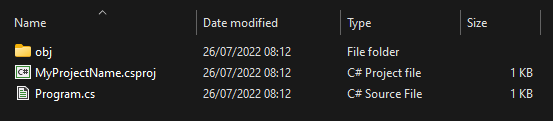
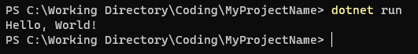

# Purpose

This file is to explain how to create a .NET Core console application.

# Contents

- [Purpose](#purpose)
- [Contents](#contents)
- [Creation](#creation)
- [Structure](#structure)
  - [The `.csproj` Project file](#the-csproj-project-file)
  - [The `Program.cs` file](#the-programcs-file)
  - [`obj` folder](#obj-folder)
  - [`bin` folder](#bin-folder)
- [How it works](#how-it-works)
  - [Building](#building)
  - [How to run](#how-to-run)

# Creation

Run the following in a terminal to create a console app in the current folder:

```
dotnet new console --framework net6.0
```

The project will be named after the containing folder

# Structure

The following things will have been added to the folder.



## The `.csproj` Project file

Project settings are stored in the `.csproj` file.

This will look something like this:

```
<Project Sdk="Microsoft.NET.Sdk">

  <PropertyGroup>
    <OutputType>Exe</OutputType>
    <TargetFramework>net6.0</TargetFramework>
    <ImplicitUsings>enable</ImplicitUsings>
    <Nullable>enable</Nullable>
  </PropertyGroup>

</Project>
```

You likely won't need to edit this file very often, unless you need to enable a very specific C# / .NET feature.

## The `Program.cs` file

Since .NET 6 came out, your `Program.cs` file will look something like this.

```
// See https://aka.ms/new-console-template for more information
Console.WriteLine("Hello, World!");
```

This is a C# file that will be run when the application is run.
From .NET 6, this file contains only directly runnable code. It will act a bit like a script, running from top to bottom, then closing the program.

However, I highly suggest you use the classic format for the Program.cs file, shown below.

```
namespace MyProjectName;

public class Program
{
    public static void Main(string[] args)
    {
        Console.WriteLine("Hello, World!");
    }
}
```

This format is what is actually being used behind the scenes, and you will need to understand it to do basically anything past the most basic stuff in C#.

To use it, just copy and paste the above over the contents of your Program.cs file.
If you do, remember to replace `MyProjectName` with the actual name of your project.

## `obj` folder

The obj folder contains temporary files used in building the application. You can safely delete this folder, but it will be recreated anyway when you run the program.

Uploading this folder is a waste of space, so don't `git commit` it.

## `bin` folder

This is where the compiled application will live. This folder likely won't exist if you haven't run the program yet.

# How it works

## Building

The process of building or compiling an application is needed before running a .NET application. Unless of course there are no changes from last time you built it.

Building can be done by calling `dotnet build`. However, this will be done automatically when you run the application with `dotnet run` anyway.

When the build happens starts, all project files are compiled into an `.exe` **binary** and dumped into the `bin` (short for binary) folder. Then the binary is run and the output
of lines like `Console.WriteLine()` are written to the terminal.

## How to run

You can run your application with the `dotnet run` command. Because it is a console application, your only UI will be terminal output.

Which terminal? Well, if you run the binary from the terminal, the output will show in the terminal you used to start the application.



If you run the binary by double clicking it or similar, a new terminal will open.

If you run the program via VSCode tasks, it may open it in an integrated Terminal tab. It depends how VSCode is configured.
