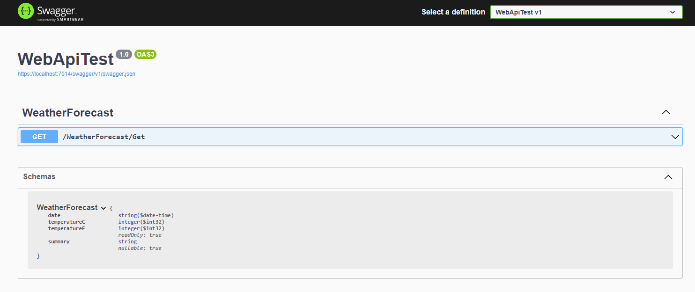
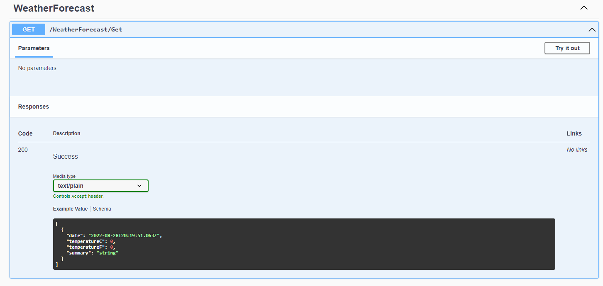

# Purpose

To explain how to start a .NET WebAPI project.

# Contents

- [Purpose](#purpose)
- [Contents](#contents)
- [Start with a template](#start-with-a-template)
- [Project Structure](#project-structure)
  - [appsettings.json](#appsettingsjson)
  - [Program.cs](#programcs)
  - [WeatherForecastController.cs](#weatherforecastcontrollercs)
- [Swagger](#swagger)

# Start with a template

Several templates are available with .NET. See more about templates [here](DotNetTemplates.md).

A good one to start a WebAPI project with is:

```ps1
dotnet new webapi --dry-run -n <PROJECT_NAME>
```

Remove the `--dry-run` once you're happy with the predicted output.

# Project Structure

After running the template, you should see a structure something like this:

```
<Project Root>
│   appsettings.Development.json
│   appsettings.json
│   Program.cs
│   WeatherForecast.cs
│   WebApiTest.csproj
│
├───Controllers
│       WeatherForecastController.cs
│
├───obj
│       ...
│
└───Properties
        launchSettings.json
```

## appsettings.json

This is where settings will be stored. You can add new fields and they will be accessible via the `Configuration` class, or using any JSON parser.

The structure of the file will be something like this:

```json
{
  "ConnectionStrings": {
    "TestDb": "Server=localhost\\MSSQLExpress;Database=Test;User ID=TestUser;Password=Password123"
  },
  "Logging": {
    "LogLevel": {
      "Default": "Information",
      "Microsoft": "Warning",
      "Microsoft.Hosting.Lifetime": "Information"
    }
  },
  "AllowedHosts": "*"
}
```

I've included a common field, `ConnectionStrings`, which can be accessed via the generic accessor:

```c#
Configuration.GetSection("ConnectionStrings")["TestDb"]
```

or the dedicated shortcut specifically for this common field:

```c#
Configuration.GetConnectionString("TestDb")
```

## Program.cs

This is where your program will start. It is also where you will do most of your configuration.

More information [here](ProgramAndStartup.md)

## WeatherForecastController.cs

This is an example controller.

To learn more about controllers, see [Controllers](Controllers.md).

# Swagger

Swagger is an interface that allows you to see all the actions on your API and run them.

It is set up by default on this template.

It is usually available at https://localhost:7014/swagger or similar.



You can see more information about an action by expanding it.



Finally, you can run the actions from here too. You will be told all the fields you need to fill.
