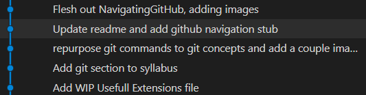
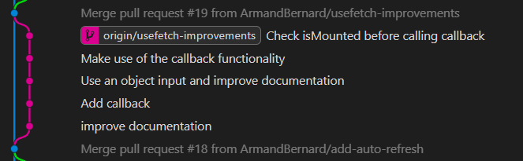

# Purpose

This file outlines common git concepts, and how it is used in a day to day basis.

# Commands

## Committing

Committing is the act of submitting changes to a project. This is similar to changing, then saving a file again on your PC.

Commits cover the whole project however, so you aren't changing a file, but the project as a whole each commit.

Committing, by contrast to saving a file over itself, is **non-destructive**. It does not get rid of the previous version, instead storing the changes between the current and previous version of the file(s).
Commits also usually include a **comment** to explain what has changed, submitted by the author of said commit.

By building a chain of commits over time, known as a [branch](#branches), you are effectively creating a version history.

The above image shows a common representation of a git branch known as a Git Graph. It shows the commits in order, ordered newest to oldest from top to bottom.

## Pushing and pulling

Git can be used entirely locally on your machine, but more likely than not, you'll want to upload it somewhere for sharing purposes or for safekeeping.
There are many remote places to host Git repositories (projects). The most common one is GitHub.

If you have a local and remote copy of your repository (project), then the remote one is usually known as the **origin**.

When either you make changes on your local copy of the repo or a change occurs on the origin, your copies will become de-synced. Pushing and pulling are used to resolve these differences.

### Pushing

If all there are no newer changes on the origin, but you have made changes locally, then you will want to push your commits to the origin. This will make the origin's branch match yours.

You will often get warnings or errors when pushing, these will usually be raised because you are about to overwrite some other changes you don't know about. You can go ahead and push anyway with the "force" version of push, but this should only be done if you really know you don't want those changes to exist any more.

Instead, you should usually [pull](#pulling) changes from origin before pushing to make sure you have all the latest changes.

### Pulling

Pulling is the act of taking changes from the origin and applying them to your local branch.

Pulling changes is simple in concept but complicated in practice. This is because there can quite often be conflicts. There are two flavours "pull" which dictate the type of conflict resolution that is done. Rebasing, and merging. Organizations usually pick one and then stick with it.

Rebasing is where you take all your local commits after the first conflict, and you put them after the ones you pull from the origin.
Merging is where you try to interweave the changes you've made in between those pulled from the origin, based on their date.

Generally, you rebase for conflict resolution, and merge only when you want to combine two non-conflicting branches (see [branches](#branches)).

## Branches

A branch is a way of contributing code without affecting other people's work.

You will always have a main branch, usually called **main**. You can commit directly to main, but you often don't want to do that. A unit of work you are doing will usually take several commits, and you usually want main to have only stable code in it, so it can be deployed to customers etc.

To avoid doing everything in one commit or breaking main, you will usually create a **branch**, which will contain the commits for a piece of work, then once the work is complete and stable, you will **merge** it back into main.

Best practice to avoid conflicts is to only have one person working on each branch at a time. Conflicts will need to be resolved with the main branch eventually (usually just before merge), but it does not have to be done for every commit done to main.

It is also bad practice to leave branches open for a significant portion of time, as it will increase the number of conflicts that need resolving.
