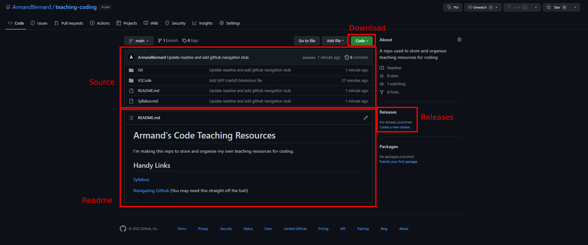
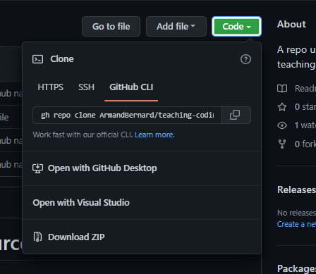

# Purpose
This file shows how to navigate GitHub. It sounds dumb, but to a complete beginner this may be helpful.

# Project Homepage

The project home page will allow you to reach most other places, and it's most likely where you'll land when you get linked a project.

## The README

The README.md file stored inside the project will show up as visible on the home page. This usually contains information on the project and how to use it.

## The Source (Project Files)

By "source" or "source code" we mean the files that developers use to develop and build a project.
Of course, it doesn't need to contain only code, but can contain images and documentation files.

This page you are reading right now is a markdown file in the project, likely being rendered by GitHub in your browser.

This section of the GitHub interface is effectively a file browser, allowing you to navigate the folders and open files of the project.

Clicking a file will show a preview in the browser.

## Downloading the Source

You can download all of the files in the project by pressing the green "Code" dropdown on the home page.

The most common mistake ever made on GitHub is thinking this is the same as the downloading the release of the program the project is for. Often people will go to GitHub to download a piece of software, not interested in the code behind the software, wanting the .exe, .dmg or similar.

For that, you likely want to go to the [Releases](#releases) page of a project.

## Releases

This part of the page contains a link to the Releases Page, if there are any releases for the project.

The Releases Page is where fully built, final copies of software are often distributed.

It will also contain Release Notes for each version released of the software, if the devs are doing their job properly.