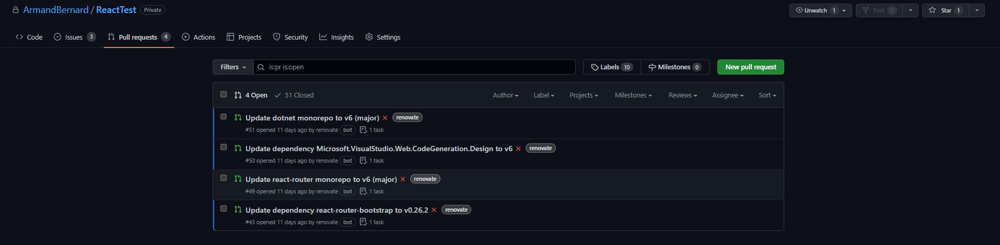
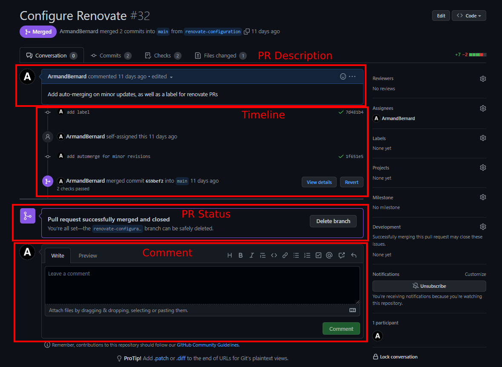

# Purpose

This file shows what Pull Requests (often abbreviated to PRs) look like. Make sure you've read up about [GitHub](NavigatingGitHub.md) and [Git Concepts](GitConcepts.md) first.

# Contents

- [Purpose](#purpose)
- [Contents](#contents)
- [Navigating to PRs](#navigating-to-prs)
- [PR Interface](#pr-interface)
  - [PR Description](#pr-description)
  - [Timeline](#timeline)
  - [PR Status](#pr-status)
  - [Comment](#comment)

# Navigating to PRs

You can get to the PR list from the top left navigation menu of GitHub. When you do so, you will be met with a list of PRs.

By default, you will **only see Open PRs**. This can be changed by clicking the greyed out closed tick thing or changing the text in the search bar.

Clicking on the name of a PR will open it.

You can also create a new PR from here.

# PR Interface

The interface for Pull Requests on GitHub are as show above.

## PR Description

The PR Description is what you write when you create a PR. It details what you did and why you're doing it.

It often contains screenshots, and details any tests you may have done to make sure the changes are safe.

The example pictured is much simpler, because its a small PR from a private project, but you would usually have more details.

## Timeline

This will show the full timeline of events that happened since this branches creation. This includes since the PR was made, as it will be kept updated automatically.

The timeline not only contains commits, but also comments and other PR related actions.

## PR Status

This will either be **Draft**, **Open**, **Closed** or **Merged**.

It will also show any currently running automated tests, if you have any.

It will also usually contain key actions, like closing or merging a PR.

## Comment

This is where you can add a comment to the timeline.

Voicing concerns or asking questions here can be helpful, as people will generally go back to PRs later to see what a change was for. This usually occurs when they find a commit that broke something, go to GitHub and see which PR it was for.
