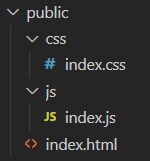

# Purpose

To explain how scripts can be added to web pages

# Contents

- [Purpose](#purpose)
- [Contents](#contents)
- [Methods of adding scripts](#methods-of-adding-scripts)
  - [Inline](#inline)
  - [In a `<script>` tag](#in-a-script-tag)
  - [From a separate file](#from-a-separate-file)

# Methods of adding scripts

Scripts can be added in several ways.

## Inline

The first way is just to inline the whole code. This is rarely a good option as it will make your lines super long.

```html
<!DOCTYPE html>
<html lang="en">
  <body>
    ...
    <div id="text-to-change">This is the current text</div>
    <button
      onclick="document.getElementById('text-to-change').textContent = 'This is the new text!'"
    >
      Change text
    </button>
    ...
  </body>
</html>
```

## In a `<script>` tag

Script tags are where you should contain larger chunks of code specific to this page.

HTML loads procedurally, so you should add probably add scripts to the bottom of the body tag to improve page loads. However, you can technically add scripts anywhere.

If your render scripts depend on some libraries, they should probably be imported at the top of the page instead.

```html
<!DOCTYPE html>
<html lang="en">
  <body>
    ...
    <div id="text-to-change">This is the current text</div>
    <button onclick="changeText()">Change text</button>
    <script>
      function changeText() {
        document.getElementById("text-to-change").textContent =
          "This is the new text!";
      }
    </script>
    ...
  </body>
</html>
```

## From a separate file

Scripts can be imported from other files.

_NOTE: If your application is being packed, make sure the path points to not the source .js file but the place it will be when bundled to._

In the html:

```html
<!DOCTYPE html>
<html lang="en">
  <body>
    ...
    <div id="text-to-change">This is the current text</div>
    <button onclick="changeText('text-to-change')">Change text</button>
    <script type="text/javascript" src="js/index.js"></script>
    ...
  </body>
</html>
```

in `index.js`:

```js
function changeText(id) {
  document.getElementById(id).textContent = "This is the new text!";
}
```

In the above example, the public folder's structure looks like this:


