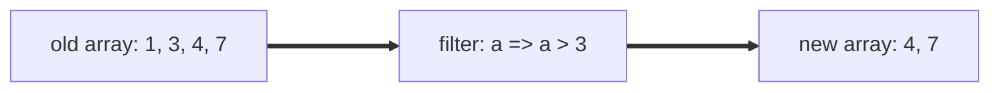
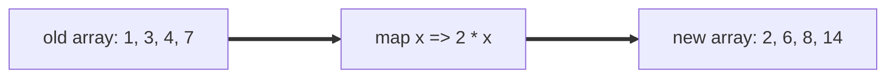

# Purpose

To explain the basics of JavaScript to someone who has never coded.

# Contents

- [Purpose](#purpose)
- [Contents](#contents)
- [What is JavaScript?](#what-is-javascript)
- [Variables](#variables)
  - [Setting variables](#setting-variables)
  - [Getting variables](#getting-variables)
  - [Difference between `const` and `let`](#difference-between-const-and-let)
- [Types](#types)
  - [Strings](#strings)
  - [Numbers](#numbers)
    - [Arithmetic](#arithmetic)
    - [Behaviours of numbers in JS](#behaviours-of-numbers-in-js)
  - [Booleans](#booleans)
    - [Logical Operators](#logical-operators)
    - [Combining statements](#combining-statements)
    - [Inverting statements](#inverting-statements)
  - [Objects](#objects)
- [Functions](#functions)
  - [Defining a function](#defining-a-function)
    - [Parameters](#parameters)
  - [Returning data](#returning-data)
    - [Multiple / early returns](#multiple--early-returns)
    - [`void` functions](#void-functions)
  - [Calling a function](#calling-a-function)
  - [Functions on Objects](#functions-on-objects)
- [Arrays](#arrays)
  - [Initializing arrays](#initializing-arrays)
  - [Indexing an Array](#indexing-an-array)
  - [Array functions](#array-functions)
    - [Filter](#filter)
    - [Map](#map)
    - [Join](#join)

# What is JavaScript?

JavaScript is a scripted language designed for the web. It started off pretty basic, but has changed a lot since its original introduction, gaining more of the features present in languages traditionally used to write full-fledged applications.

You can run JavaScript in all normal browsers, and nowadays you can also run it standalone as a console application with Node.js.

# Variables

Variables are what you use to store values you want to use later. Whether that's performing a calculation, getting text from a user etc.

There are two recommended ways to store use variables in JavaScript: `let` and `const`. You may also see `var` around in legacy (i.e. old) code, but it is not recommended to use it.

For now, I'll use const, as its what you should use by default. I'll go over the differences later.

## Setting variables

Say that you want to store the number `3` in a variable called `a`. This is how you would do it:

```js
const a = 3;
```

In programmer speak, you are **setting** `a` to `3`. The opposite would be `getting`, which is reading the value back out.

Breaking down the above syntax:

- `const` is the keyword indicating you are declaring a variable
- `a` is the name of the variable
- `=` is to indicate you want to set the thing on the left to be the value on the right (the order matters).
- `3` is the value to set the variable to.
- `;` is an indicator that this is the end of the command.

## Getting variables

So you've stored a value in a variable. What now?

Well, you'll have to `get` its value. To do that, you simply have to `call` its name.:

```js
const a = 3; // set a to 3
const b = a; // set b to the value of a (3)
```

is equivalent to

```js
const b = 3;
```

The important part here is that you just need to say its name and it will be like calling the value.

## Difference between `const` and `let`

You can use both let and const to store variables:

```js
const a = 3;
let b = 5;
```

So, what is the difference between using const and let?

`let` allows you to `set` a variable more than once.

i.e.

```js
let a = 3; // a is 3
a = 5; // a is now 5
```

Note a small detail here: you only need to say `let` or `const` when you declare a variable, i.e. the first time it is used.

You cannot set a variable to another value if it is declared with const:

```js
const a = 3; // a is 3
a = 5; // ❌ error!
```

So why use `const` at all, if it is more restrictive?

Well, its about good coding practice.

If you have a lot of code between setting a variable and using it, it may not be obvious what the value is at any given time.

```js
let a = 3;

... /// (lots of code here)

a = 5;

... /// (lots more code)

const b = a; // we may not know what the value is of a here!

```

By using `const`, you are saying that the value of a variable will not change. This means that when it comes to use the value you don't need to check all your code to see if it might have changed partway along.

This is called **immutability**. (The variable cannot mutate i.e. change)

This sort of thing makes your life a lot easier when the code gets longer and more complicated, multiple people work on the same code or you haven't seen you own code in a while!

# Types

Although JavaScript is not a strongly typed language, it does have type of data you'll have to interact with.

## Strings

Strings are what you store text in. It's called that probably because you are stringing together characters.

Characters are numbers, letters spaces, anything you can type.

For example, the following is a string.

```js
const words = "Hello World";
```

When declaring a string (i.e. saying what its contents are), you generally use double quotes. This is to make clear where the borders of the string are. For example:

`" Hello World"` and `"Hello World"` are not the same string, as the former has a space at the start. The space is a part of the string, so if you were to print it in a console or show or send it in a message, it would be shown.

## Numbers

`number` is the type you use when you want to store a numeric value you want to do calculations on, for example addition, counting etc.

```js
const a = 3;
```

### Arithmetic

Numbers support all the basic arithmetic you can do in a basic calculator.

```js
const a = 2 + 3; // 5
const b = 4 - 1; // 3
const c = 3 * 2; // 2 times 3 => 6
const d = 9 / 3; // 9 divided by 3 => 3
```

Of course, the same operations will work with stored numbers:

```js
const a = 2;
const b = 3;
const c = a * b; // 6
```

### Behaviours of numbers in JS

Numbers in JavaScript are somewhat ambiguous in their implementation. They can act like integers or floating point numbers depending on what you do to them and how you declare them.

I won't go into the intricacies of floating point and integers and how they act here, but for those who don't know what they are:

- integers are whole numbers e.g. `2, 5, 13, 16`
- floating point numbers are typically numbers that have a decimal place e.g. `0.1, 12.3, 6000.0`

This distinction is usually not very important in JavaScript at a beginner level, so I wouldn't worry about it too much.

## Booleans

The word "boolean" is used to describe a value that can be only `true` or `false`.

When you make an statement that can either be true or false, also known as a **predicate**, such as "a is larger than b", the result is a boolean that can only be true or false.

For example you can write:

```js
const a = 2;

const b = 3;

// predicate: a is larger than b. In this case, the result is false, which is saved into c
const c = a > b;
```

### Logical Operators

There are many operators or symbols you can use to make predicates. Here are some of them.

**Equality**

```js
// a is equal to b
a === b;

// a is not equal to b:
a !== b;
```

**Size**

```js
// a is larger than b
a > b;

// a is smaller than b
a < b;

// a is larger than or equal to b
a >= b;

// a is smaller than or equal to b
a <= b;
```

### Combining statements

You can combine multiple statements using logical _and_ and _or_ statements:

**And**

Use a double ampersand `&&`

```js
// a is smaller than b and c is equal to d
a < b && c === d;
```

**Or**

Uses a double bar characters `||`

```js
a != b || d < e;
```

### Inverting statements

You can invert a statement by applying a **not** operator to it. This is done by placing an exclamation mark before the statement.

```js
// a is not larger than b
!(a > b);
```

Of course, this is equivalent to `(a <= b)`, but sometimes it's easier to follow to use a not to make it easier to understand in context.

## Objects

Objects are a way of storing multiple related numbers, strings and even other objects one variable.

For example, you could create an object representing a cat.

```js
const cat = {
  name: "Josh",
  weight: 10.2,
  age: 4,
};
```

The name, weight and age are all `properties` on the `cat` object. The `:` acts a little like a `=` here, allowing you to set that property.

You can access the values of a property using the dot (`.`) syntax.

```js
const a = cat.age; // a is now 4

cat.weight = 10.4; // the weight of the cat is now 10.4
```

# Functions

Functions, also known as methods, are pieces of code that can be run on demand.

## Defining a function

There are two ways of defining a function. First, the traditional `function` syntax:

```js
function functionName(parameter1, parameter2) {
  /// The code the function runs goes in here
}
```

Second, the `arrow function` syntax

```js
const functionName = (parameter1, parameter2) => {
  /// The code the function runs goes in here
};
```

Both are equivalent, but in some cases you'll only be able to use the arrow syntax.

Here, the functionName is the name of the function, which you will need to `call` or use the function.

### Parameters

The `parameters` are defined inside the brackets. You can have as many or as few as you want. These are values you want the user of the function to provide.

For example a function to add two numbers together would look a little like this:

```js
function addTwoNumbers(value1, value2) {
  return value1 + value2;
}
```

or

```js
const addTwoNumbers = (value1, value2) => {
  return value1 + value2;
};
```

Here `value1` and `value2` are the `parameters`.

More on the `return` part in the next section.

## Returning data

When a function is done doing its thing, it should `return`.

Going back to the `addTwoNumbers` example, the caller of the `addTwoNumbers` function would like to know the result of the calculation. To provide it to them, we need to `return` a value.

When you `return` in a function, you are ending the execution of the function and, optionally, returning a result.

### Multiple / early returns

You may want to return early in certain scenarios, especially if the action you want to perform is not doable or requires another implementation.

For example, say you want to make a division function, but want to avoid divide by zero errors. You could write a function like this:

```js
function divide(numerator, denominator) {
  if (denominator === 0) {
    // early return / alternative return path
    return 0;
  }

  return numerator / denominator;
}
```

### `void` functions

Functions don't have to return data at all, they can just perform an action, then end.

Good examples of this are the `console.log()` and `alert()` functions. You don't expect them to give you data, but just to perform an action.

```js
// log an error to the console with the date
function logError(errorMessage) {
  if (errorMessage === undefined) {
    // early return with no data
    return;
  }

  console.error(`[${new Date().toISOString()}][ERROR]: ${errorMessage}`);
  // code just ends after this. No need to return.
}
```

Note that a void function does not need a return, unless you want to return early.

## Calling a function

When you want to run the code in a function, you `call` it.

The calling syntax is the same, regardless of whether you defined it as an `arrow function` or regular `function`:

```js
// call a function and store its return value
const variableToHoldReturnValue = functionName(parameter1, parameter2);
```

If it is a void function there is no return value, so no need to create a variable to store the return value:

```js
// call a function
functionName(parameter1, parameter2);
```

Functions with no parameters still need brackets to call them:

```js
functionName();
```

## Functions on Objects

Functions can also exist on `object`s.

Say for example that you have objects of type `Person`:

```ts
// What is a person? 🤔
interface Person {
  name: string;
  age: number;
  height: {
    feet: number;
    inches: number;
  };
}
```

And you want to add a function that when called, describes the person. You could do this:

```ts
// What is a person? 🤔
interface Person {
  name: string;
  age: number;
  height: {
    feet: number;
    inches: number;
  };
  describe: () => void;
}
```

The implementation could then be:

```js
// make a person
const nico: Person = {
  name: "nico",
  age: 26,
  height: {
    feet: 5,
    inches: 4,
  },
  describe: () => {
    return `${nico.name} is ${nico.age} and ${nico.height.feet} foot ${nico.height.inches}`;
  },
};
```

You could then call the describe function later:

```js
const description = nico.describe();
```

# Arrays

Arrays allow you to hold multiple values in a specific order, kind of like a list.

## Initializing arrays

Arrays can be **initialized** or created using square brackets:

```js
const myArray = [13, 5, 7, 9];
```

The above array has 4 **elements** or items.

In TypeScript, you can define an array based on what it is meant to hold:

```ts
const myArray: number[] = [13, 5, 7, 9];
```

## Indexing an Array

You can access a specific item in an array by **indexing** it. To do this, you need to know which position it has in the array, know as its **index**.

Like most programming languages, JavaScript uses **zero-based indexing**. This means you start counting from zero, rather than one.

The first item in an array has index 0, the next one has index 1, then 2 etc.

To index an array, you use a syntax like this:

```js
// get
const a = myArray[index];

// set
myArray[index] = b;
```

Here are some examples:

```js
const myArray = [13, 5, 7, 9];

// this gives a === 5, as we start counting from 0
const a = myArray[1];

// this gives b === 7
const b = myArray[2];

// the array will now be [3, 5, 7, 9]
myArray[0] = 3;
```

## Array functions

Arrays are a very powerful way of doing the same thing to multiple items.

There are therefore many functions available with arrays that allow you to manipulate them. Usually they are accessed using the **dot** syntax.

Most of them will use **arrow functions** as parameters, so that you can tell them what action to perform or what check to complete on each item.

Here are some of the most common ones.

### Filter

Say you only want some of your items, so you want to filter them by some condition or set of condition. The `filter` function is best for this.

```js
const newArray = myArray.filter((item) => predicateUsingItem);
```

Note that the **original array is not modified**. Calling the filter function returns a **new filtered array**.



Here a **predicate** is a statement that returns true or false.

For example: `a > 2`, `someCondition === true`, `isEven || isNegative` are all predicates.

If the predicate returns `true`, the item is **included** the returned array, if `false`, it is not included.

Here is an example of how you could filter items to only keep values larger than 4:

```js
const variousNumbers = [1, 3, 5, 8, 9];

// The left part of the arrow function says given item "n", keep items above 4.
const filteredNumbers = variousNumbers.filter((n) => n > 4);

// [5, 8, 9]
console.log(filteredNumbers);
```

Here's another example with strings:

```js
// filtering by length of string, returns ["Short", "Acceptable"]
const filtered = ["Short", "Acceptable", "Way too long"].filter(
  (s) => s.length < 10
);
```

### Map

The map function allows you to **transform** each element an array in a controlled way.



To use it, you must provide a function that takes an element and returns the new value you want to have back.

It returns the same amount of items as you started.

For example doubling every number:

```js
const myArray = [1, 3, 4, 7];

// multiply every item by 2: [2, 6, 8, 14]
const newArray = myArray.map((x) => 2 * x);
```

You can also use it to get specific values on an object:

```js
cat1 = {
  weight: 4,
  length: 0.45,
};

cat2 = {
  weight: 4.5,
  length: 0.5,
};

const catArray = [cat1, cat2];

// [4, 4.5]
catWeights = catArray.map((cat) => cat.weight);
```

### Join

Join is specifically for arrays of strings. It allows you to join all the strings in an array into one string.

When you do this, you usually also provide a separator, which is a string that will be placed between every joint string. This is good for representing lists of items.

```js
const myArray [1, 2, 3, 4];

// join with dots
const joinedString = myArray.join(".")

// output: "1.2.3.4"
console.log(joinedString);

```
