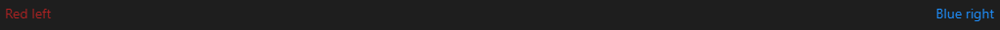

# Purpose

To go over some of the more complex / niche things you can do with Markdown.

Note that not all features here will be supported by every Markdown renderer.

See [this page](https://www.markdownguide.org/extended-syntax/) for more information.

To specifically see what flavour of Markdown GitHub supports, see [this spec](https://github.github.com/gfm/)

GitHub also supports other extended markdown stuff like mathematical expressions, flowcharts and more. See their documentation page [here](https://docs.github.com/en/get-started/writing-on-github/working-with-advanced-formatting).

# Contents

- [Purpose](#purpose)
- [Contents](#contents)
- [Using HTML](#using-html)
  - [Superscript and subscript](#superscript-and-subscript)
  - [Collapsed Sections](#collapsed-sections)
- [Tables](#tables)
- [Syntax highlighting](#syntax-highlighting)
    - [Code blocks with syntax highlighting](#code-blocks-with-syntax-highlighting)
- [Mathematical equations](#mathematical-equations)
- [Diagrams with Mermaid](#diagrams-with-mermaid)
  - [Flowcharts](#flowcharts)
  - [Gantt Charts](#gantt-charts)
  - [Pie Charts](#pie-charts)
  - [Git Graph](#git-graph)

# Using HTML

Markdown will allow you to write static HTML in your Markdown. Most of the time, there is no need to do this, however, you may want to do this to do some extra formatting markdown does not natively support.

Naturally, scripts in your HTML will most likely not be run, as this is a security issue, and some Markdown renderers may not render the HTML correctly at all. GitHub for example is very restrictive on what it will show for security reasons. It will remove many properties including inline-styles.

```html
<div style="display: flex; justify-content: space-between">
  <span style="color: firebrick">Red left</span>
  <span style="color: dodgerblue">Blue right</span>
</div>
```

<div style="display: flex; justify-content: space-between">
    <span style="color: firebrick">Red left</span>
    <span style="color: dodgerblue">Blue right</span>
</div>

Depending on where you are viewing this, you may see the below intended look or something not quite the same.



## Superscript and subscript

You can do superscript and subscript using the HTML `<sub>` and `<sup>` tags:

```html
H<sub>2</sub>O

y = mx<sup>2</sup>
```

H<sub>2</sub>O

y = mx<sup>2</sup>

Alternatively, you can use LaTeX. See [Mathematical Equations](#mathematical-equations).

## Collapsed Sections

Collapsible sections can be created using the `<details>` and `<summary></summary>` tags together:

```html
<details>
    <summary>Goodies inside</summary>
    🍬🍭🍫
</details>
```

<details>
    <summary>Goodies inside</summary>
    🍬🍭🍫
</details>

These sections will be collapsed by default.

# Tables

Tables are a bit of a pain to type nicely, but extensions like [Markdown All in One](https://marketplace.visualstudio.com/items?itemName=yzhang.markdown-all-in-one) will automatically clean them up for you.

```
| Student  | Grade |
| -------- | ----- |
| Nicholas | A     |
| Fabien   | C     |
```

| Student  | Grade |
| -------- | ----- |
| Nicholas | A     |
| Fabien   | C     |

# Syntax highlighting

### Code blocks with syntax highlighting

GitHub and some IDE's will allow you to add language information to your code block. This will provide automatic syntax highlighting to the code with minimal effort, making it easier to read.

````
```js
// code blocks are good for showing multiple lines of code
if (itNeedsDoing) {
    doIt()
}
```
````

```js
// code blocks are good for showing multiple lines of code
if (itNeedsDoing) {
  doIt();
}
```

# Mathematical equations

Mathematical equations can be typed using [LaTeX](https://en.wikibooks.org/wiki/LaTeX/Mathematics).

To type a LaTeX expression, wrap with `$` for inline...

```
The equation for a straight line in 2 dimensions is $y=mx+c$.
```

The equation for a straight line in 2 dimensions is $y=mx+c$.

...or `$$` for a full width block

```
$$x=\frac{-b\pm\sqrt{b^2-4ac}}{2a}$$
```

$$x=\frac{-b\pm\sqrt{b^2-4ac}}{2a}$$

# Diagrams with Mermaid

Diagrams can be made and rendered using [Mermaid](https://mermaid-js.github.io/mermaid/#/).

Make sure to install [some extensions](../VSCode/UsefulExtensions.md#markdown) so you can preview these in VSCode.

## Flowcharts

Flowcharts are highly configurable and are useful for showing what order actions should be taken in.

[Mermaid documentation](https://mermaid-js.github.io/mermaid/#/flowchart)

Also see the similar [State Diagrams](https://mermaid-js.github.io/mermaid/#/stateDiagram).

````

````


## Gantt Charts

Gantt charts are all about showing tasks on a timeline.

[Mermaid documentation](https://mermaid-js.github.io/mermaid/#/gantt)

````

````


## Pie Charts

````

````


## Git Graph

Used to show a git history, with branches.

[Mermaid documentation](https://mermaid-js.github.io/mermaid/#/gitgraph)

