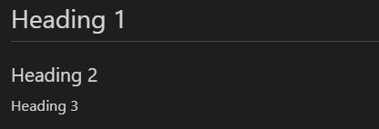

# Purpose

To explain what markdown is and what it can be used for.

# Contents

- [Purpose](#purpose)
- [Contents](#contents)
- [What is Markdown?](#what-is-markdown)
- [Basic Syntax](#basic-syntax)
  - [Headers](#headers)
  - [Text Formatting](#text-formatting)
    - [Italics](#italics)
    - [Bold](#bold)
    - [Block quote](#block-quote)
    - [Bold and Italic](#bold-and-italic)
    - [Lineout](#lineout)
    - [Escaping characters](#escaping-characters)
  - [Lists](#lists)
    - [Unordered Lists](#unordered-lists)
    - [Ordered Lists](#ordered-lists)
    - [Mixed and nested](#mixed-and-nested)
    - [Checkboxes](#checkboxes)
  - [Code](#code)
    - [Inline](#inline)
    - [Code block](#code-block)
    - [Code blocks with syntax highlighting](#code-blocks-with-syntax-highlighting)
  - [Horizontal rules (lines)](#horizontal-rules-lines)
  - [Links and images](#links-and-images)
    - [Links](#links)
    - [Images](#images)

# What is Markdown?

According to https://daringfireball.net/projects/markdown/:

_Markdown is a text-to-HTML conversion tool for web writers_

What this means in practice is that it allows you to format text for the web in a way that is more human-readable than HTML.

It is great for writing rich documentation for things like wiki pages without a fancy editor like Microsoft Word and without having to switch between keyboard and mouse, making it very efficient for writers.

It has become a popular standard amongst software developers, and its syntax is supported on many platforms. 

Much of its basic syntax is supported on messaging apps like Discord and Slack, and GitHub supports all of its native features plus extra.

Almost all of the documentation you see in this project is written in Markdown!

You can recognize a Markdown file by its `.md` extension.

# Basic Syntax

Here I will highlight the most common pieces of syntax you will likely want to use with Markdown. You may recognize some of this syntax from your favourite messengers and websites!

You can also go to this very good guide: https://www.markdownguide.org/basic-syntax/.

## Headers

Headers can be done by adding a hash (`#`) at the start of a line, with the number of hashes indicating the header level. More hashes means a lower heading level.

Input:
```
# Heading 1
## Heading 2
### Heading 3
```

Output:

(I have used an image here because otherwise it would mess with my table of contents)



## Text Formatting

You can format text in all the classic ways easily in markdown.

### Italics

```
_Italicized text_ or *Italicized text*
```

_Italicized text_ or *Italicized text*

### Bold

```
**Bolded text**
```

**Bolded text**

### Block quote

```
> Something smart someone said
```
> Something smart someone said

### Bold and Italic

```
***Very important text*** or **_italic and bold_, bold**
```

***Very important text*** or **_italic and bold_, bold**

### Lineout

```
~~A mistake~~
```

~~A mistake~~

### Escaping characters

If you want to type one of teh above characters normally without incurring Markdown formatting, you can use a backslash (`\`).

```
\*Not italicized text\*
```
\*Not italicized text\*

## Lists

### Unordered Lists

```
- Item George
- Item Kathy
- Item Dale
```

- Item George
- Item Kathy
- Item Dale

### Ordered Lists

```
1. Item 1
1. Item 2
1. Item 3
```

1. Item 1
1. Item 2
1. Item 3

### Mixed and nested

Items can be nested, however, you cannot use letters or extra formatting without extensions.
You should use 4 spaces or 1 tab to indent.

```
1. Item 1
- Item 1 part 1
    - Item 1 part 2
1. Item 2
```

1. Item 1
    - Item 1 part 1
    - Item 1 part 2
1. Item 2

### Checkboxes

These may not be supported on every platform, but they are supported on GitHub.

```
- [x] I've done this
- [ ] But not this
```

- [x] I've done this
- [ ] But not this

## Code

Code, or monospaced text, can be shown in a few different ways.

### Inline

```
I have set `numberOfChickens` to 2.
```

I have set `numberOfChickens` to 2.

### Code block

These are what I use in all the previous examples.

``````
```
// code blocks are good for showing multiple lines of code
if (itNeedsDoing) {
    doIt()
}
```
``````

```
// code blocks are good for showing multiple lines of code
if (itNeedsDoing) {
    doIt()
}
```

### Code blocks with syntax highlighting

GitHub and some IDE's will allow you to add language information to your code block. This will provide automatic syntax highlighting to the code with minimal effort, making it easier to read.

``````
```js
// code blocks are good for showing multiple lines of code
if (itNeedsDoing) {
    doIt()
}
```
``````

```js
// code blocks are good for showing multiple lines of code
if (itNeedsDoing) {
    doIt()
}
```

## Horizontal rules (lines)

Horizontal lines can be added to split up the document.

```
---
```

---

## Links and images

Links can be made to external websites or local files.

### Links

Links that are not embedded are typed like this:

```
[Wikipedia](https://en.wikipedia.org/)
```
[Wikipedia](https://en.wikipedia.org/)

Local files can be linked using relative paths.

```
[README.md](../README.md)
```
[README.md](../README.md)

### Images

Links to images will work fine, but if you want to embed them, you'll need to add a `!`:

```

```
