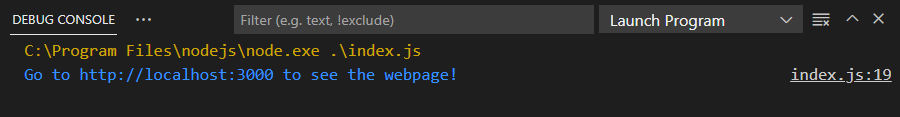

# Purpose

Get you up and running with Node.js! Running through the below steps will create a new Node.js application which can load a html file.

# Steps to creating a basic web app

## Node Setup

Initialise node

`npm init -y`

Enable ESModule syntax by adding
`"type": "module"` to package.json.

## Add a .gitignore

The following steps will add a lot of files to the project we don't want to add to git, so add a `.gitignore` at the root of the project with the following contents:

```
/node_modules

package-lock.json
```

## Basic Homepage

To host a basic homepage, start by installing [express](https://expressjs.com/) and its types:

`npm install express`

`npm install --save-dev @types/express`

Then create a basic HTML file in your root directory called `index.html`:

```html
<!DOCTYPE html>
<html lang="en">
  <head>
    <meta charset="utf-8" />
    <meta name="viewport" content="width=device-width, initial-scale=1.0" />
  </head>
  <body>
    Hello World
  </body>
</html>
```

Also make a start point for your program called `index.js`:

```js
import express from "express";
import { promises as fsp } from "fs";

// port to host on
const port = process.env.PORT || 3000;
const app = express();

// create a page endpoint for the index.html file
app.get("/", async (_, res) => {
  // read html file
  const html = await fsp.readFile("index.html", "utf8");

  // send html to the user
  res.send(html);
});

// get express to listen on the port, and tell the user what port we're using
app.listen(port, () =>
  console.log(`Go to http://localhost:${port} to see the webpage!`)
);
```

## Add a VS Code run task

We can create VS Code action to allow us to run code from VSCode easier.

Create a new folder called `.vscode` then add a file called `launch.json` with these contents:

```json
{
  // Use IntelliSense to learn about possible attributes.
  // Hover to view descriptions of existing attributes.
  // For more information, visit: https://go.microsoft.com/fwlink/?linkid=830387
  "version": "0.2.0",
  "configurations": [
    {
      "type": "node",
      "request": "launch",
      "name": "Launch Program",
      "skipFiles": ["<node_internals>/**"],
      "program": "${workspaceFolder}\\index.js"
    }
  ]
}
```

At this point, your project folder should now look something like this:


You should now be able to run your app either by running

```
node .
```

or by using VSCode UI


Once it's running, you will see this in the console:



Ctrl + click on the link to go to the webpage your site is being hosted on, and you should see the words "Hello World!".

Congrats! You just created a basic website!
