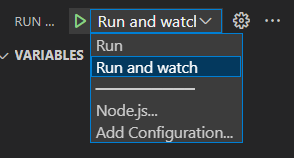

# Purpose

To make it so changes are refreshed live!

# Making your website refresh on save

Building on the [getting started](GettingStarted.md) guide, we will now make it so that you don't need to restart the whole program every time you make a change to a file in the project!

## Install Nodemon

Nodemon will monitor our files and restart the app whenever the files change.

To install nodemon, run `npm i --save-dev nodemon`.

## Add a new watch script

You can make easily runnable scripts in `package.json` to allow us to run the program in different ways.

We will make two scripts, one for running normally and one for running and watching for changes.

Update the scripts section in package.json to look like this:

```json
  "scripts": {
    "start": "node index.js",
    "watch": "nodemon index.js"
  },
```

As you can likely guess, the watch one is used to run and watch for changes.

## Update VS Code's launch configurations

Now to update VS Code's launch configurations.

Replace the contents of `launch.json` with

```json
{
  // Use IntelliSense to learn about possible attributes.
  // Hover to view descriptions of existing attributes.
  // For more information, visit: https://go.microsoft.com/fwlink/?linkid=830387
  "version": "0.2.0",
  "configurations": [
    {
      "type": "node",
      "request": "launch",
      "name": "Run",
      "runtimeExecutable": "npm",
      "runtimeArgs": ["run-script", "start"]
    },
    {
      "type": "node",
      "request": "launch",
      "name": "Run and watch",
      "runtimeExecutable": "npm",
      "runtimeArgs": ["run-script", "watch"]
    }
  ]
}
```

You should now have two launch configurations. Make sure you select the watch one!



# Usage

When you launch via this configuration and save a file in the project, the application will be restarted. You will not notice this happening, and it will likely be very quick.

You won't, however, see the changes in the webpage straight away. You'll need to refresh your browsers webpage first!

To test this, try changing the text in the html, saving, then refreshing the page.
